# Домашнее задание к занятию  «Защита хоста»

### Задание 1

1. Установите **eCryptfs**.
2. Добавьте пользователя cryptouser.
3. Зашифруйте домашний каталог пользователя с помощью eCryptfs.

### Ответ

Был установлен пакет acryptfs-utils

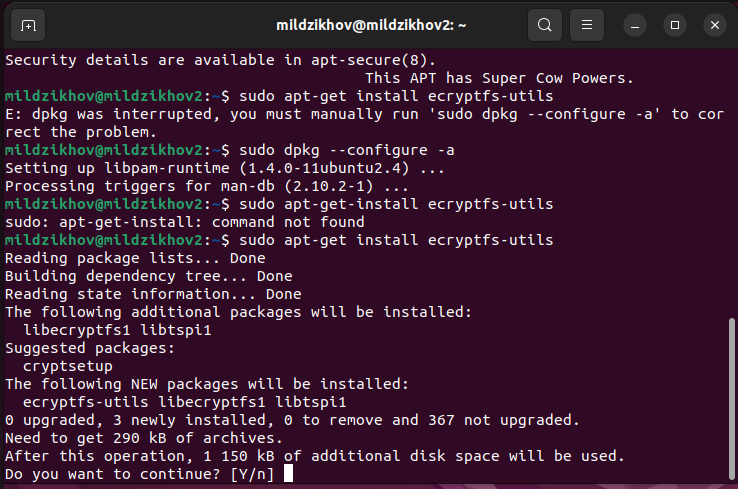

Добавлен пользователь cryptouser и прописан в файле sudoers, а так же в директории пользователи созданы файлы

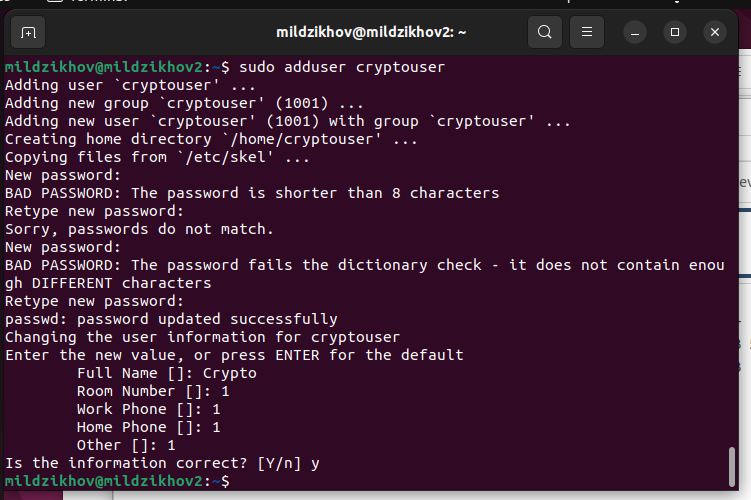

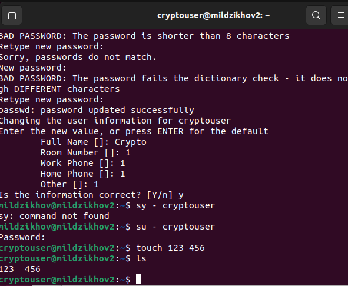

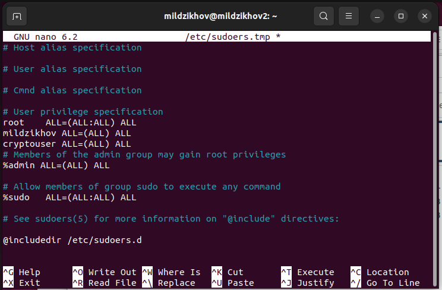
С помощью команды sudo ecryptfs-migrate-home -u cryptouser зашифрован каталог пользователя

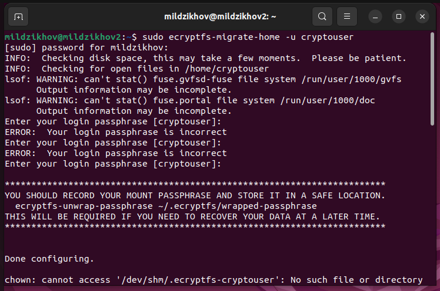

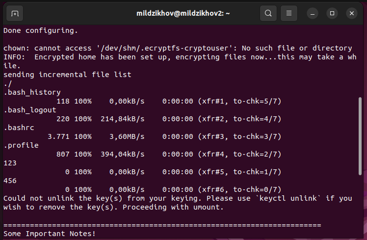

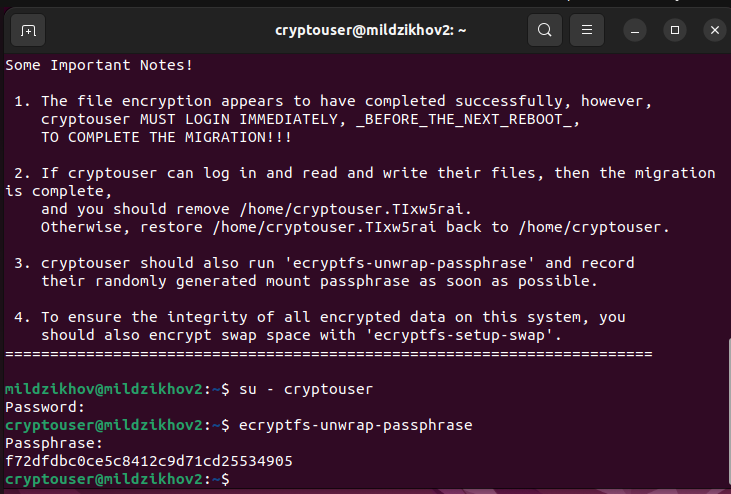

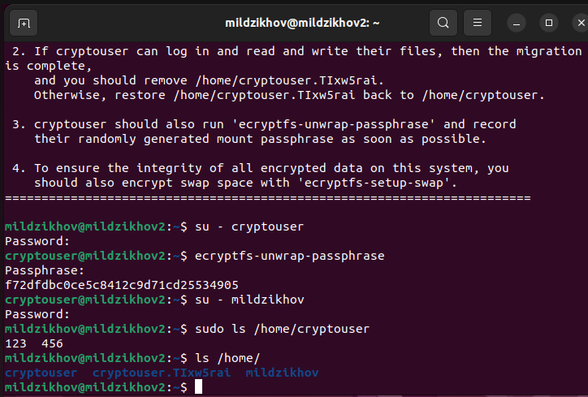

### Задание 2

1. Установите поддержку **LUKS**.
2. Создайте небольшой раздел, например, 100 Мб.
3. Зашифруйте созданный раздел с помощью LUKS.

### Ответ

Была установлена поддержка LUKS - пакет cryptsetup

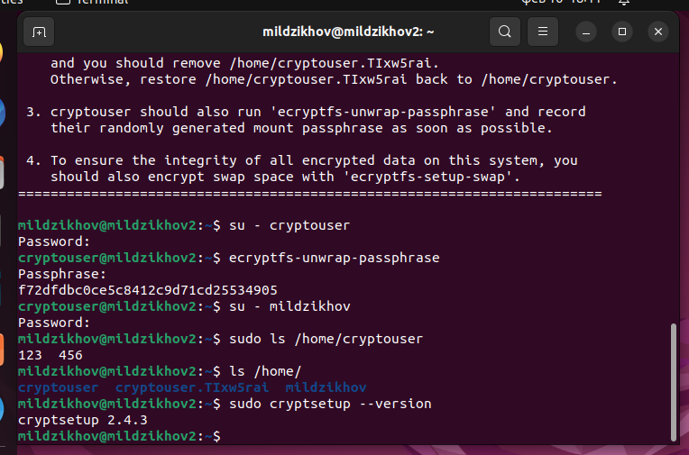

Так как нет технической возможности создать новый раздел из-за нехватки места, продублирую ниже команды, которые необходимо проделать для шифрования раздела при помощи LUKS.

Шифровать разделы sda1, sda2, sda3 нельзя, так как это может привести к сбоям работы системы.
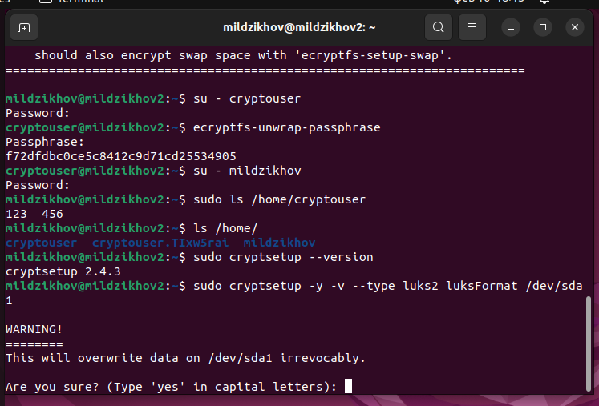

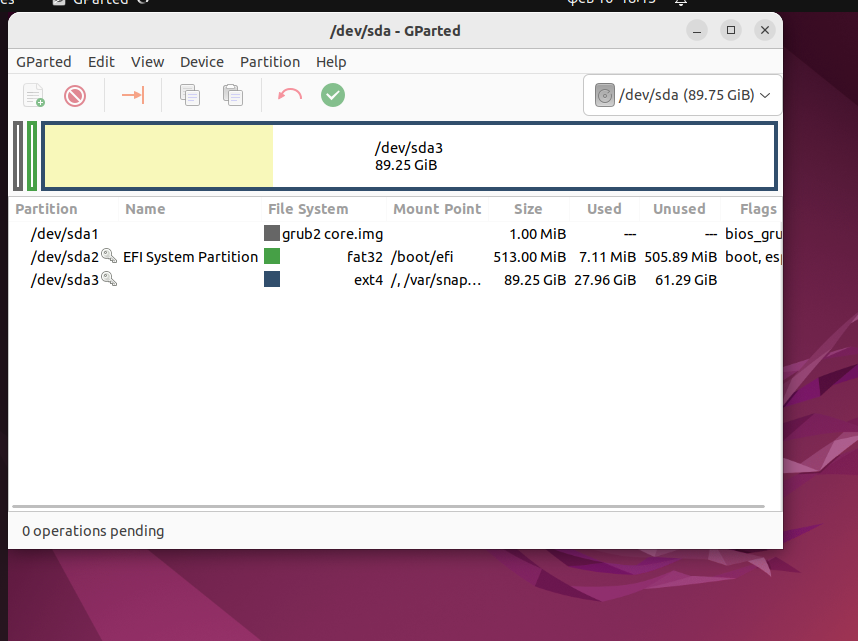

sudo cryptsetup -y -v --type luks2 luksFormas /dev/sdb1 - сама шифровка

sudo cryptsetup luksDump /dev/sdb1 - для проверки шифрования
